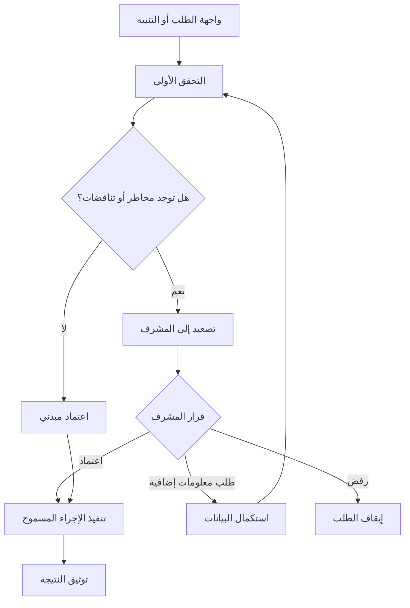

# moteb-arabic-arch

مستودع معماري عربي يوضح طبقة الواجهة ومسار التحقق والاعتماد باستخدام رسوم Mermaid.

## ملخص الواجهة

- **الواجهة**: تستقبل الطلب أو التنبيه وتعرض حالته الحالية بوضوح.
- **التحقق الأولي**: يراجع البيانات الأساسية مثل الهوية، الشبكة، المبلغ، والرسوم.
- **المراجعة والإقرار**: يرفع الحالات الحساسة إلى المشرف قبل أي إجراء غير قابل للعكس.
- **التوثيق**: يسجل القرار النهائي والأدلة والإجراء المنفذ دون تضمين أسرار أو مفاتيح.

## مخطط الواجهة والمسار الرقابي

