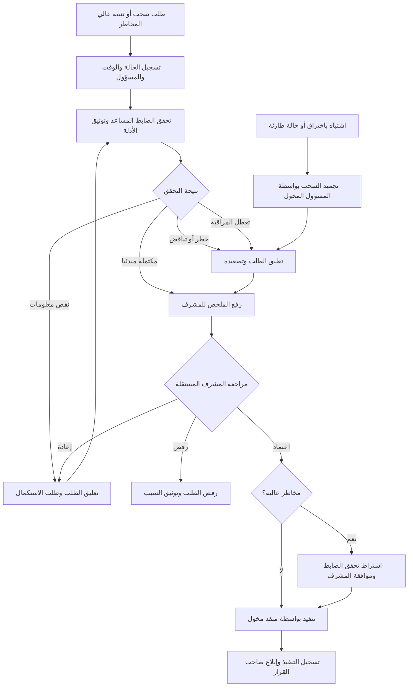

# moteb-arabic-arch

مستودع معماري عربي يوضح مساراً رقابياً آمناً لمراجعة طلبات السحب والتنبيهات عالية المخاطر، باستخدام رسوم Mermaid.

## الأدوار والضوابط

- **الضابط المساعد**: يراجع كل طلب سحب وكل تنبيه عالي المخاطر، ويتحقق من الهوية وعنوان الوجهة والشبكة والمبلغ والرسوم والحدود وسجل النشاط وإشارات المخاطر ومصادرها. يصنف الحالة إلى مكتملة مبدئياً أو تحتاج معلومات إضافية أو عالية المخاطر، ويوثق الأدلة والسبب ويرفعها للمشرف. صلاحياته للعرض والتوثيق والتصعيد فقط؛ لا ينفذ السحب ولا يغير إعدادات الأمان.
- **المشرف**: يراجع الحالة والأدلة باستقلالية، ثم يعتمد الإجراء أو يرفضه أو يعيد الحالة لاستكمال المعلومات. لا ينفذ إجراء حساس قبل الاعتماد المطلوب، ويشترط للحالة عالية المخاطر تحقق الضابط المساعد وموافقة المشرف.
- **المنفذ المخول**: ينفذ الإجراء المسموح بعد استيفاء الموافقات، ويسجل النتيجة. يجب أن يكون منفصلاً عن الضابط المساعد في الحالات عالية المخاطر.
- **صاحب القرار**: يستلم خلاصة موثقة للحالات المهمة، تشمل ما تم التحقق منه والقرار والإجراء المنفذ والنقاط المعلقة.

تظل الحالة معلقة عند وجود تناقض أو مؤشر خطر أو نقص معلومات أو تعطل أداة مراقبة؛ لا يُسمح بتجاوز المراجعة لتنفيذ إجراء غير قابل للعكس. عند الاشتباه بالاختراق أو الخطر العاجل، يفعّل المسؤول المخول تجميد السحب ويصعّد الحالة فوراً. يقتصر الوصول إلى الأدلة والتقارير على من يحتاجها لأداء دوره.

## مخطط الواجهة والمسار الرقابي

## الحالة وسجل التدقيق

لكل حالة معرّف وحالة حالية ومسؤول ووقت وسبب موثق لكل انتقال. تشمل الحالات: مستلمة، قيد التحقق، معلقة لاستكمال المعلومات، مصعدة للمشرف، معتمدة، مرفوضة، قيد التنفيذ، منفذة، ومجمدة للطوارئ. يسجل النظام عمليات العرض والتصنيف والتصعيد والاعتماد والرفض والتنفيذ، مع مراجع الأدلة دون نسخ أسرار إلى السجل. ترسل التنبيهات المهمة والخلاصة النهائية إلى صاحب القرار المحدد.

لا تخزن المفاتيح الخاصة أو عبارات الاسترداد أو بيانات الاعتماد في السجلات أو التقارير، ولا تمنح هذه العملية صلاحية إنشاء المفاتيح أو استخراجها أو تجاوز ضوابط الأمان.

## سيناريوهات القبول

- يظل السحب عالي المخاطر معلقاً ولا ينفذ إلا بعد توثيق تحقق الضابط المساعد وموافقة المشرف المستقلة.
- يؤدي رفض المشرف إلى إيقاف الطلب مع تسجيل القرار والسبب والمسؤول والوقت، وإبلاغ صاحب القرار.
- يؤدي نقص المعلومات إلى تعليق الحالة وإعادتها للاستكمال دون تنفيذ.
- يؤدي تعطل أداة المراقبة إلى تعليق الطلب عالي المخاطر وتصعيده، لا إلى اعتباره سليماً.
- يؤدي الاشتباه بالاختراق إلى تفعيل تجميد السحب بواسطة المسؤول المخول وتسجيل التصعيد والإجراء.
- لا يستطيع الضابط المساعد تنفيذ السحب أو تغيير إعدادات الأمان، ولا تستطيع العملية إنشاء المفاتيح الخاصة أو استخراجها.
