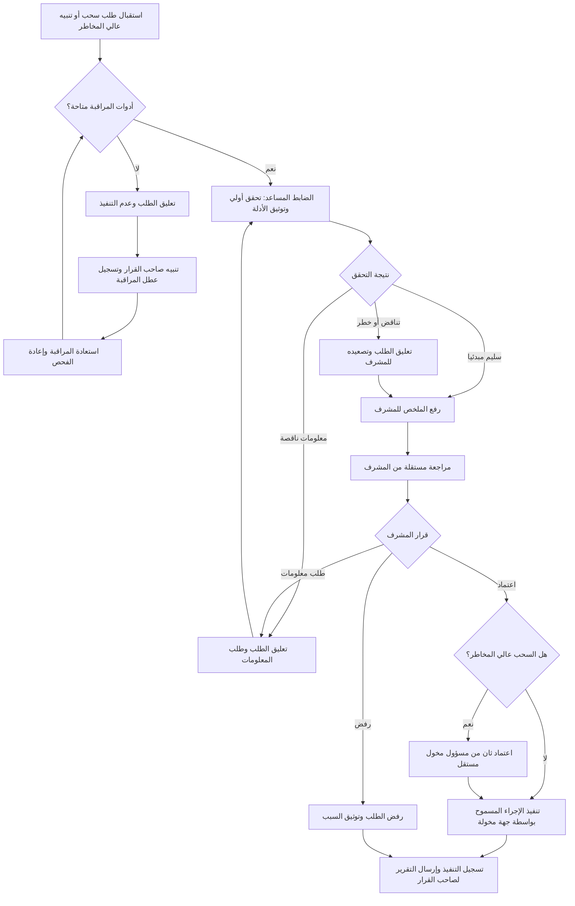

# moteb-arabic-arch

مستودع معماري عربي يوضح طبقة الواجهة ومسار التحقق والاعتماد باستخدام رسوم Mermaid.

## مسار مراجعة السحب والحالات عالية المخاطر

## التحقق والصلاحيات

- يراجع الضابط المساعد كل طلب سحب وكل تنبيه مصنف عالي المخاطر، ويتحقق من هوية مقدم الطلب، وعنوان الوجهة، والشبكة، والمبلغ، والرسوم، والحدود، وسجل النشاط، ومصدر إشارات المخاطر.
- صلاحيات الضابط المساعد للقراءة والتوثيق وطلب المعلومات والتصعيد فقط؛ لا ينفذ السحب، ولا يعتمد الطلب، ولا يغير إعدادات الأمان، ولا ينشئ أو يستخرج مفاتيح خاصة أو عبارات استرداد.
- يراجع المشرف الأدلة والطلب باستقلال عن التحقق الأولي، ويعتمد الإجراء أو يرفضه أو يعيده لاستكمال المعلومات. لا ينفذ أي إجراء غير قابل للعكس قبل الاعتمادات المطلوبة.
- يتطلب السحب عالي المخاطر اعتماد المشرف واعتمادا ثانيا من مسؤول مخول مختلف عن الضابط المساعد والمشرف. لا يجوز للشخص نفسه الجمع بين التحقق والاعتمادات المطلوبة.
- عند وجود تناقض أو خطر أو نقص معلومات، يبقى الطلب معلقا ولا ينفذ. عند الاشتباه باختراق، يفعّل المسؤول المخول تجميد السحب الطارئ ويصعّد الحادث؛ لا يستأنف التنفيذ إلا بعد معالجة السبب وإعادة التحقق والاعتماد.
- عند تعطل مصدر مراقبة مطلوب، تعلق الطلبات المتأثرة ولا تتجاوز الفحوص؛ يبلغ صاحب القرار ويسجل العطل. بعد استعادة المصدر، تعاد مراجعة الطلبات المعلقة قبل اتخاذ أي إجراء.

## الحالة والتدقيق والتقرير

- لكل حالة حالة حالية واضحة، ومسؤول الخطوة، ووقت الإجراء، وسببه؛ وتشمل الحالات: مستلمة، قيد التحقق، معلقة لاستكمال معلومات أو عطل مراقبة، مصعدة للمراجعة، معتمدة، مرفوضة، منفذة، أو مجمدة طارئا.
- يسجل سجل التدقيق عمليات العرض والتوثيق والتصعيد والاعتماد والرفض والتنفيذ والتجميد والاستئناف، مع هوية المنفذ والتوقيت والسبب والمرجع إلى الأدلة. لا تسجل فيه المفاتيح الخاصة أو عبارات الاسترداد أو الأسرار.
- يقتصر الوصول إلى الأدلة والتقارير على من يحتاجها لأداء دوره. يرسل التقرير النهائي والتنبيهات المهمة إلى صاحب القرار المحدد، ويتضمن التقرير ما تم التحقق منه، والقرار وسببه، والاعتمادات، والإجراء المنفذ، والنقاط المعلقة.
