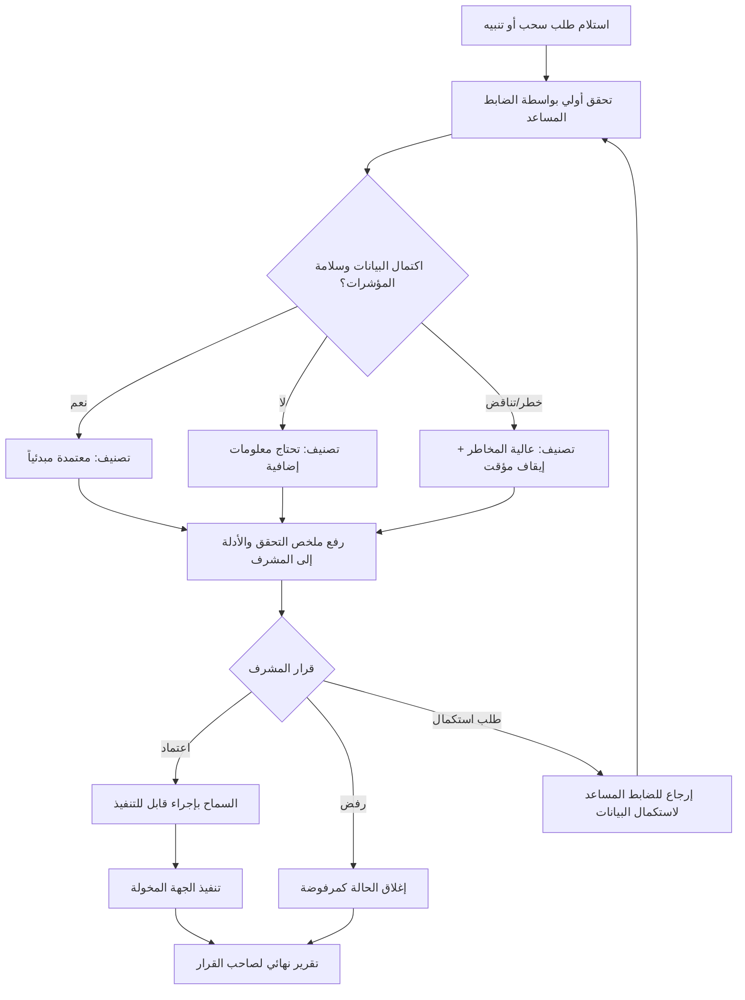

# moteb-arabic-arch

مستودع معماري عربي يوضح مسار رقابي آمن للتحقق من طلبات السحب والتنبيهات عالية المخاطر، مع الفصل بين الأدوار قبل أي إجراء حساس.

## الهدف

تنظيم مسار يضمن أن:
- الضابط المساعد ينفذ **التحقق الأولي فقط**.
- المشرف ينفذ **مراجعة مستقلة واعتماد/رفض**.
- التنفيذ الحساس لا يتم إلا بعد الاعتماد المناسب.
- كل خطوة موثقة زمنياً مع سبب القرار دون تخزين أسرار.

## نطاق التحقق

يشمل التحقق لكل طلب سحب أو تنبيه عالي المخاطر:
- هوية مقدم الطلب.
- عنوان الوجهة والشبكة.
- المبلغ والرسوم والحدود المسموحة.
- سجل النشاط وسياق المعاملة.
- إشارات المخاطر الصادرة من أدوات المراقبة ومصادرها.

## الأدوار والصلاحيات

- **الضابط المساعد**: قراءة، تقييم، تصنيف، وتصعيد فقط.
- **المشرف**: مراجعة مستقلة، اعتماد/رفض/إرجاع لاستكمال المعلومات.
- **جهة التنفيذ المعتمدة**: تنفيذ الإجراء المسموح بعد الاعتماد.
- **صاحب القرار**: يستلم خلاصة موثقة بالحالات المهمة والنتائج.

ضوابط إلزامية:
- منع الضابط المساعد من تنفيذ السحب منفرداً أو تغيير إعدادات الأمان.
- تطبيق الفصل بين المهام والموافقة الثنائية للحالات عالية المخاطر.
- منع تنفيذ أي إجراء غير قابل للعكس دون موافقة مطلوبة.

## حالات الطلب ومسار المراجعة

الحالات الأساسية:
- **قيد التحقق الأولي**
- **معتمدة مبدئياً**
- **تحتاج معلومات إضافية**
- **عالية المخاطر (موقوفة مؤقتاً)**
- **معتمدة نهائياً**
- **مرفوضة**
- **منفذة**
- **مغلقة مع نقاط معلقة**

## متطلبات السجل والتدقيق

- تسجيل جميع عمليات العرض، التصنيف، التصعيد، الاعتماد، التنفيذ، والإغلاق.
- ربط كل خطوة بـ: المسؤول، الوقت، الحالة، وسبب القرار.
- توثيق الأدلة التي بُني عليها القرار (مخرجات مراقبة، تحقق هوية، حدود، سجل نشاط).
- **يمنع** تضمين المفاتيح الخاصة أو عبارات الاسترداد أو أي أسرار في السجلات أو التقارير.
- حماية التقارير والبيانات الحساسة بمبدأ الحاجة إلى المعرفة.

## إجراء الطوارئ

عند الاشتباه باحتيال أو اختراق:
- تفعيل **تجميد السحب** فوراً.
- إبقاء الحالة في مسار مراجعة عالي المخاطر حتى صدور قرار مشرف.
- توثيق سبب التجميد ومدته ومن رفع التجميد.

## معايير القبول

- لا يمكن تنفيذ السحب عالي المخاطر دون تحقق الضابط المساعد واعتماد المشرف.
- كل حالة تُظهر حالتها الحالية، المسؤول عن كل خطوة، وقت الإجراء، وسبب القرار.
- التقارير والتنبيهات الجوهرية تصل إلى صاحب القرار المحدد.
- لا تمنح العملية أي صلاحية لإنشاء/استخراج مفاتيح خاصة أو تجاوز ضوابط الأمان.

## سيناريوهات تحقق مطلوبة

- **حالة رفض**: المشرف يرفض بعد مراجعة مستقلة، وتغلق الحالة مع سبب واضح.
- **نقص معلومات**: تعاد الحالة لاستكمال البيانات ولا تتقدم للتنفيذ قبل الاكتمال.
- **تعطل مصدر مراقبة**: تصنف الحالة عالية المخاطر وتوقف مؤقتاً حتى الاستعادة أو قرار مشرف.
- **تجميد طارئ**: عند الاشتباه، يتم التجميد الفوري ومنع التنفيذ إلى حين الاعتماد.
